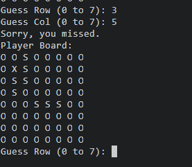
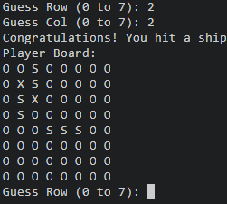
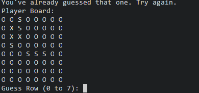
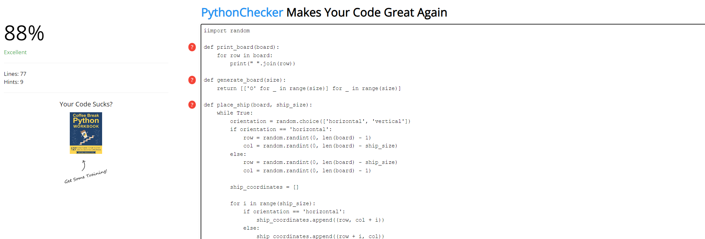

# Battleship Game

## Overview

- Welcome to the Battleship game! This simple text-based game allows you to play the classic Battleship game in the terminal. Sink the computer's ships by making strategic guesses, and enjoy the thrill of naval warfare!
- https://github.com/LinusMolin98/1223

## Action Testing

## Code Validation

## Purpose

The purpose of this Python application is to provide a fun and interactive gaming experience. The Battleship game allows users to engage in a strategic naval battle with the computer, testing their skills in guessing ship locations and sinking the opponent's fleet.

## Value to Users

- **Entertainment:** Enjoy a classic board game in a digital format.
- **Strategic Thinking:** Sharpen your strategic thinking skills by making calculated guesses to sink computer ships.
- **Terminal-Based Experience:** Play the game directly in the terminal, offering a simple and accessible interface.

## How to Play

1. **Game Setup:**
   - The game begins by randomly placing a specified number of ships on an 8x8 grid.
   - Your goal is to guess the coordinates of the computer's ships and sink them all.

2. **Making a Guess:**
   - The game prompts you to enter the row and column coordinates for your guess.
   - Row and column indices are zero-based, starting from 0.
   - Input is validated to ensure it falls within the valid range.

3. **Game Feedback:**
   - After each guess, the game provides feedback:
     - If you hit a ship, it congratulates you and marks the hit on the board.
     - If you miss, it informs you that you've missed.
     - If you've already guessed a position, it prompts you to try again.

4. **Winning the Game:**
   - The game continues until you sink all the computer's ships.
   - A victory message is displayed once all ships are successfully sunk.

## Additional Notes
- This version of the game is designed for a simple text-based experience in the terminal.
- Feel free to explore and enhance the code for additional features or improvements.

## Credits 
- This Battleship game is a basic implementation inspired by the classic board game.
- Developed by [Linus Molin].

## What does the program do? 
- This Python application is a text-based implementation of the classic Battleship game. Users engage in a strategic naval battle with the computer, making guesses to sink the opponent's fleet. The game offers entertainment and a platform for users to test their strategic thinking skills.

## Identifying errors and repairing them
### Manual Testing Procedures
- Input Validation: Manually test the game by entering valid and invalid row/column inputs during guesses. Ensure the game handles input errors gracefully.
- Game Logic: Manually test different scenarios, including hitting ships, missing, and winning the game. Verify that the game provides accurate feedback.

## Library software 
- This application uses standard Python libraries for basic functionality and does not rely on external libraries for graphical user interfaces. The game is a terminal-based experience, making it easily accessible to users without the need for additional software.

 
