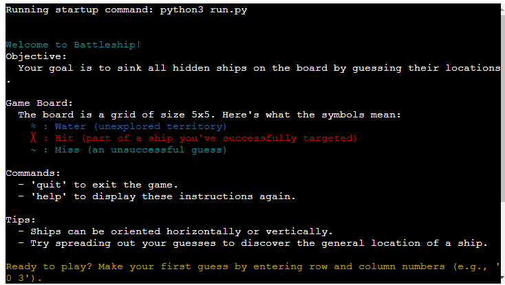
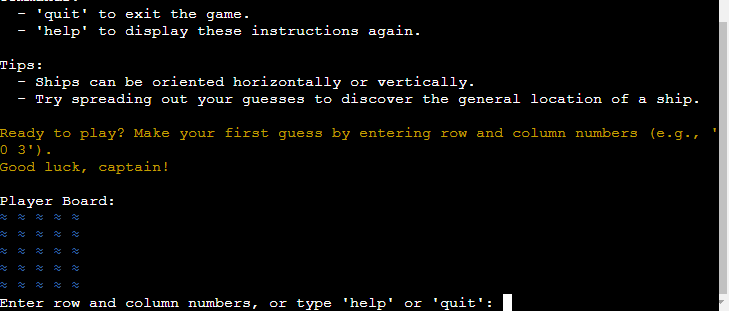
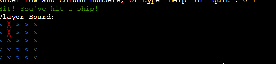
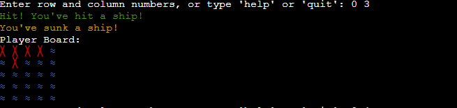
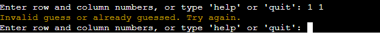
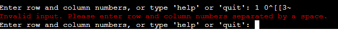
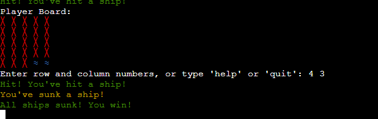
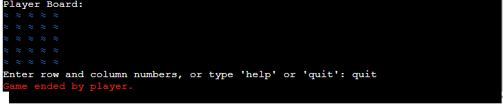
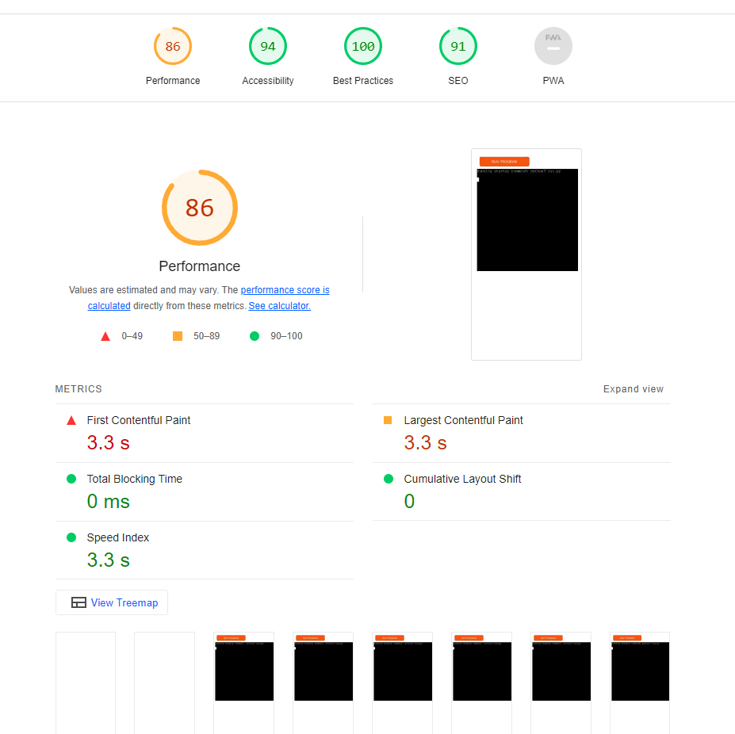

# Battleship Game
(https://battle-ships-linus-2648feb5d4fb.herokuapp.com/)

## Am i Responsive

## Table of Contents
1. [Overview](#overview)
2. [UX](#ux)
   - [User Stories](#user-stories)
   - [Design](#design)
   - [Wireframes](#wireframes)
3. [Features](#features)
   - [Existing Features](#existing-features)
   - [Features Left to Implement](#features-left-to-implement)
4. [Technologies Used](#technologies-used)
5. [Testing](#testing)
   - [Action Testing](#action-testing)
   - [Bug Reports](#bug-reports)
6. [Deployment](#deployment)
7. [Credits](#credits)
   - [Content](#content)
   - [Media](#media)
   - [Acknowledgements](#acknowledgements)

## Overview
The Battleship Game is a digital version of the classic board game, allowing players to place ships on a grid and guess the locations of their opponent's ships. Designed with Python and utilizes a command-line interface for gameplay, it's a project aimed at demonstrating fundamental programming concepts and user interaction through the console.

## Starting the Game
- The game starts up and gives the player clear guidance in how to play the game.

## Getting started 
- The game introduces the player board wich is designed nicely to make it more apealing to the user, its designed to look like water.

## Making your first guesses 
- The game is fully responsives and gives direct feedback when the coordinates are entered. 

## Hitting ships
- When a ship is hit, the player gets the response highlighted in green for maximum feedback.

## Sinking your first ship
- After a few guesses, the player sinks there first ship, the feedback is highlighted in orange.

## Invalid guess or guessing the same coordinates again
- When guessing the same coordinates twice, the game will give you the feedback that the player cant make the same guess twice, and ask the user to choose again.

## Entering coordinates incorrect 
- When entering coordinates wrong, the game will tell you how you have to write the coordinates for them to be valid. 

## Sinking all the ships and winning
- When all the ships have been sunk, the player wins the game and is informed through direct feedback, the game automatically quits. 

## Quitting game before winning
-To quit the game, the user simply writes "quit" in the log and the game will end instantly. 

## UX
### User Stories
- As a **player**, I want to **easily understand how to start a game** so that **I can begin playing with minimal setup**.
- As a **player**, I want to **receive feedback on my guesses** so that **I can adjust my strategy accordingly**.

### Design
- **Color Scheme**: The game uses a simple color scheme with blue for the ocean, red for hits, and green for ships to make the game intuitive and visually appealing.
- **Typography**: The game output in the console uses the default monospace font for clarity and readability.
- **Imagery**: Being a CLI-based game, ASCII art and colored text enhance the user experience and represent the game grid and ship statuses.

### Wireframes
This project did not use wireframes due to its nature as a CLI application.

## Features
### Existing Features
- Game initialization with custom board sizes.
- Random ship placement with varying orientations.
- Player input for guessing ship locations with feedback.

### Features Left to Implement
- Multiplayer functionality.
- AI opponent for single-player mode.

## Technologies Used
- Python for game logic and CLI interaction.
- Colorama for colored CLI output.

## Testing
### Action Testing
- **Game Initialization**: Tested that the game initializes correctly with user-defined board sizes.
- **Ship Placement**: Verified that ships are placed randomly and do not overlap.

## Pep8 validation

## Lighthouse 

### Bug Reports
- **Resolved**: An issue where guesses outside the board boundaries caused errors. Added input validation to resolve.
- **Unresolved**: Occasionally, the color output does not reset correctly on some terminals.

## Deployment
This project is run locally. To start the game, clone the repository and run `python battleship.py` in your terminal, ensuring Python 3.x is installed.

## Credits
### Content
- Game logic and rules were adapted from the traditional Battleship board game.

### Media
- ASCII art for ships and the board was created specifically for this project.

### Acknowledgements
- Inspired by childhood memories of playing Battleship with friends and family.

 
